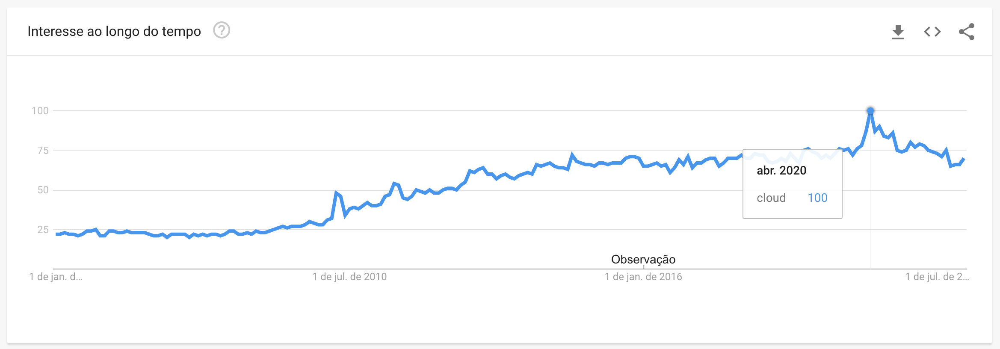

#WIP

Draft intro with a brainstorm of topics. Needs to be polished when all chapters are finished.

### Brainstorm sobre cloud:

* A onda da cloud:
  * Cloud já está em sua segunda década de existência. 
    *  *"Embora certo nível de fornecimento de serviços remotos já existisse ao final dos anos 90, em 2002 a Amazon se destaca ao lançar a amazon web services platform. Apenas por volta do ano 2006 o termo "Cloud Computing" se popularizou dentre um numero crescente de potenciais usuários."* [Trecho do livro "Cloud Computing, de Thomas Erl"] 
  * Jackie Fenn, um consultor analista da empresa Gartner, deu início ao modelo Hype Cycle em 1995;
  * A proposta do modelo é representar a maturidade de determinada categoria de tecnologias de acordo com sua adoção e interesse por parte das organizações do mercado. Referências sobre o modelo hype cycle: https://www.gartner.com/en/research/methodologies/gartner-hype-cycle 
  * "Cloud computing" de acordo com o hype cycle do gartner:
    * Em 2008: Primeira aparição do termo posicionado na categoria inicial, "Technology Trigger", no hype cycle de tecnologias emergentes; 
    * Em 2009:
      * Tem seu pico representado no hype cycle de tecnologias emergentes, representado na categoria "peak of inflated expectations". 
      * é publicado o **primeiro** "Hype Cycle for Cloud Computing". Neste relatório, são avaliadas e categorizadas de maneira mais granular as variadas tecnologias no escopo de cloud computing.
    * Entre 2010 e 2011: é posicionado na categoria seguinte, "Peak of inflated expectations"; 
    * Entre 2012-2016: Cloud Computing passa a navegar a categoria "Trough of disillusionment". 
    * Em paralelo, em 2015:
      * o termo "Cloud computing" deixa de ser representado graficamente na categoria emerging technologies hype cycle. (potencialmente devido a sua ampla adoção e maior compreensão das vantagens de sua adoção.) 
    * Em 2017, "Cloud computing" atinge a categoria Slope of Enlightenment.
    * Para 2021, Gartner esperava que a maioria dos workloads no mundo enterprise funcionarão sobre nuvens públicas. 
    
* Google trends:
  * Trend sobre o termo "cloud" em todo o mundo entre 01/01/2005 e 01/01/2022. Repare o pico em 2020, logo no início da pandemia do COVID-19. A pandemia foi anunciada pela OMS no dia 11 de Março de 2020.
    {width=60%}
    

Referências:
* Gartner reports: cloud computing hype cycle
  * https://www.gartner.com/en/documents/1078112/hype-cycle-for-cloud-computing-2009
  * https://www.gartner.com/en/documents/1410914/hype-cycle-for-cloud-computing-2010
  * https://www.gartner.com/en/documents/1753115/hype-cycle-for-cloud-computing-2011
  * https://www.gartner.com/en/documents/2102116/hype-cycle-for-cloud-computing-2012
  * https://www.gartner.com/en/documents/2573318/hype-cycle-for-cloud-computing-2013
  * https://www.gartner.com/en/documents/2807621/hype-cycle-for-cloud-computing-2014
  * https://www.gartner.com/en/documents/3106717/hype-cycle-for-cloud-computing-2015
  * https://www.gartner.com/en/documents/3400717/hype-cycle-for-cloud-computing-2016
  * https://www.gartner.com/en/documents/3772110/hype-cycle-for-cloud-computing-2017
  * https://www.gartner.com/en/documents/3884671/hype-cycle-for-cloud-computing-2018
  * https://www.gartner.com/en/documents/3956097/hype-cycle-for-cloud-computing-2019
  * 2020 - Não encontrei a lista como as anteriores
  * https://www.gartner.com/en/documents/4003590-hype-cycle-for-cloud-computing-2021

Após aproximadamente três anos após o início da pandemia global de covid-19^1^, as mudanças no mercado consumidor refletiram diretamente na utilização de serviços de cloud. Pesquisa^2^ realizada em 2021 aponta que, dentre os 750 entrevistados, 99 por cento destes utilizam serviços de cloud pública ou privada. Ainda nesta pesquisa, dentre diversos desafios de uma migração de aplicação on-premise para a cloud, as três principais dificuldades enfrentadas são:
- O mapeamento de dependências da aplicação;
- Avaliação de viabilidade técnica da migração;
- Validação da comparação de custos entre se manter a aplicação on-premise ou em cloud.

Profissionais do mundo Java devem ter em mente a inevitável missão não de lidar com novos serviços e aplicações que nascerão cloud-native, mas também com os legados. Além disto, devem se manter munidos de conhecimento sobre o mais recente ecossistema Java cloud-native para que esteja preparado para propor arquiteturas modernas.

### Brainstorm sobre flightplan

#### Geral:
- O plano de vôo é o processo mais importante de um vôo comercial;
- Sem planos de voos, é impossível fazer controle de tráfego aéreo
- Todo vôo comercial obrigatoriamente precisa de um flightplan
- Até os menores ajustes para otimizar um plano de vôo podem resultar em economias substanciais para a frota
- Com o flightplan pode-se garantir que a aeronave cumpra com todos os regulamentos operacionais necessários para aquele vôo.
- É devido às informações contidas no plano que a tripulação do vôo é capaz de conduz o vôo de maneira segura;
- Existem sistemas que calculam e geram automaticamente flightplans, e são usados a décadas. Ainda assim, busca-se um ajuste fino, que resulta não só em economia de combustível, mas é capaz de reduzir a emissão de dióxido de carbono (CO2). Note que a queima de ~3.8 litros de combustível (equivalente a um galão em medida norte americana, U.S. gallon) emite mais de 9kg (20 libras) de CO2 no meio ambiente.     
- https://get.oreilly.com/ind_the-cloud-in-2021-adoption-continues.html

#### Ex. de informações contidas em um plano de vôo:
  -

A operação segura da aeronave depende em alto grau do desempenho satisfatório dos sistemas de
comunicação e navegação, que por seu turno, está diretamente ligado à perícia daqueles que fazem a sua
manutenção.

1. Boeing, effective flight plans can help airlines economize: https://www.boeing.com/commercial/aeromagazine/articles/qtr_03_09/article_08_1.html

1. OMS declara pandemia de Covid-19: https://www.who.int/director-general/speeches/detail/who-director-general-s-opening-remarks-at-the-media-briefing-on-covid-19---11-march-2020
2. State of the cloud report, por Flexera: https://info.flexera.com/CM-REPORT-State-of-the-Cloud