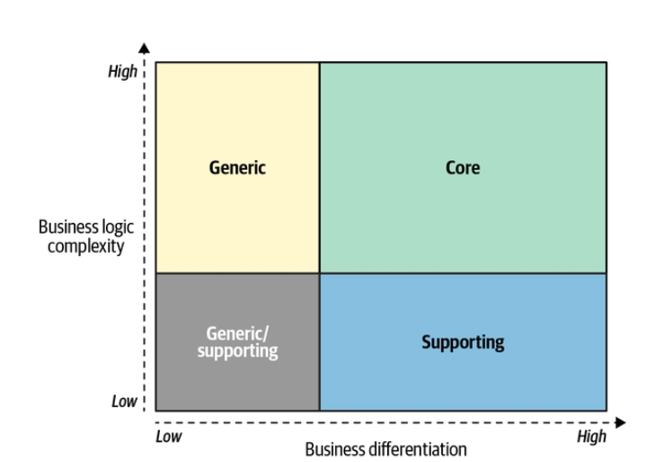

# Cloud

*Cloud computing*, em português computação em nuvem, se refere a um modelo de utilização de recursos computacionais. É um termo que sai do um meio técnico e se extende inclusive à cultura popular.

Nos anos 2000, ficou evidente que quanto mais acirrada a disputa por clientes e destaque no mercado, maior é o investimento reportado no setor de tecnologia, sendo a adoção de ambientes de cloud um dos temas principais. A disputa trás ao cenário casos interessantes como o exemplo reportado pelo então CEO da Microsoft, que reporta notar [em apenas dois meses o equivalente a dois anos de transformação digital](https://www.microsoft.com/en-us/microsoft-365/blog/2020/04/30/2-years-digital-transformation-2-months/).

Pois bem, este capítulo apresenta ao leitor ao contexto que circunda o período de evolução e adoção do cloud computing, e apresenta um overview de conceitos fundamentais a respeito das diferentes formas de se consumir serviços de cloud.

## A origem

Na perspectiva de investimento, sempre vimos a necessidade de fazer com o que a aplicação desenvolvida chegue o mais rápido possível na mão do usuário e investidores. Seja para justificar o custo, seja para garantir que o software atenderá a real necessidade do usuário.

Isso vem tornando cada vez mais evidente, principalmente, dado que complexidade e os detalhes dentro um produto/projeto tende a crescer e se integrar mais, tornando o desenvolvimento cada vez mais caro com o passar do tempo.

Aos poucos o modelo cascasta passa a dar espaço a modelos focados em entregas menores e com flexibilidade para mudanças. 

I> ### A bit more on: Waterfall model
I>
I> O modelo cascata, em inglês waterfall, é um modelo de entrega de software onde a entrega de software é dividida em fases e tarefas, sendo que estas tarefas são planejadas de forma linear e possuem data de início e fim bem definidos.
I>
I> Neste modelo é comum ter de aguardar ciclos de meses ou até mesmo anos desde a definição de escopo, entrega final, obtenção e ajustes dos primeiros feedbacks do usuário acerca do cenário em questão.
I> 

Diante desta necessidade, o [manifesto ágil](https://agilemanifesto.org/) foi revolucionário. Dentre as diversas práticas apresentadas pelo manifesto, uma das mais críticas é a colaboração, eficiente troca de informações, entre times de T.I. e de negócios.

A prática de se ter o usuário trabalhando próximo do time de desenvolvimento foi o catalisador de significativas mudanças no mundo da T.I., chegando a influenciar até mesmo recomendações de boas práticas para escrita e design de código. Dentre as diversas novas literaturas e metodologias oriundas desta abordagem está o [Domain-Driven Design, DDD](https://www.amazon.com/dp/0321125215) e sua proposta de que até mesmo o código deve refletir diretamente o domínio do negócio.

Os casos de sucesso da adoção de modelos ágeis apontavam uma direção correta, mas a caminhada precisava de mais velocidade. Notou-se que o como o ciclo de feedback reduziu, haviam muito mais solicitações de implantaçães em ambientes como desenvolvimento, homologação, produção.

Um dos gargalos neste ciclo eram os processos envolvidos na disponibilização de nova versões de uma aplicação. Apesar do curto ciclo de implementação, enfrentava-se ainda longos processos de implantação da aplicação. Especialmente as implantações em produção, costumavam incluir coordenação de times, planejamento de dia e horário, plano de rollback em caso de falha, notificação a usuário final e assim por diante. Este processo precisava ser aperfeiçoado. 

Nasce então a cultura [DevOps](https://aws.amazon.com/devops/what-is-devops/) com foco em maior integração entre o time de desenvolvimento com o time de operação. 

Da cultura DevOps surgiram novas recomendações e boas práticas. Um famoso exemplo é a [Integração Contínua](https://www.amazon.com/dp/0321336380) que busca melhorar a qualidade do software e a reduzir riscos. O conceito desta cultura se extendeu para outros setores da tecnologia resultando na ramificação em outras culturas de integração como [DevSecOps](https://dzone.com/articles/starting-with-information-security-how-to-avoid-he).

Mas nesta história, onde entra a [cloud](https://www.nist.gov/news-events/news/2011/10/final-version-nist-cloud-computing-definition-published) afinal de contas? 

É neste momento que a computação em nuvem decola, mostrando a facilidade que usuários podem ter ao entregar o software. A nuvem deixa de ser vista apenas como "um servidor de um outro alguém", e passa a ser "um problema de outro alguém". Por fim, pode-se dizer que utilizar um serviço de cloud significa delegar gestão de hardware, operações e/ou todo o processo de desenvolvimento e manutenção de um software.

## Por que a adoção é crítica para o sucesso da organização?

Em termos de utilização da mão de obra de forma efetiva, cloud se mostra como uma excelente opção para se delegar todas as operações que não fazem parte do core da organização. Afinal de contas, "é o problema de outro alguém".

a #TODO #OTAVIO Não entendi muito bem, tem como refrasear?
Pensando tecnologia como uma escolha estratégica para um negócio e parafraseando o livro [Learning Domain-Driven Design](https://www.amazon.com/dp/1098100131). É crítico colocar um esforço naquilo que será um diferencial para o negócio ou seja o core ao invés de recursos que apoiam. 

a #TODO precisa atualizar essa imagem pq pertence ao livro

Diante destas possibilidades, o que faria sentido para uma organização?  Manter e gerenciar o seu próprio hardware, nas diversas regiões do mundo? Ou delegar esta responsabilidade a um fornecedor de serviços de cloud?

Vamos entender melhor o contexto com a clássica comparação [de Albert Barron] entre pizzas e serviços de cloud, por uma  perspectiva de usuário. (https://www.linkedin.com/pulse/20140730172610-9679881-pizza-as-a-service/).

xxxxxxxxxx 
a #TODO #Otavio, será que consegue dar um tapa nesse trecho? Acho que poderia até mesmo ser um pouquinho mais sucinto. 

Porém, focando em organização, ou seja, ao invés do usuário focaremos na pizzaria em si.

No primeiro cenário, temos uma pizzaria do qual ela é responsável por todo o processo:

- Pela fazenda, colheita de trigo, queijo
- Logística dos materiais entre a fazenda e a pizzaria
- A criação da pizza (o core do meu negócio)
- A entrega da pizza na casa dos usuários

Esse primeiro também é o pior cenário ao negócio, uma vez que como pizzaria se gasta muita carga cognitiva em diversos processos além da parte mais importante que é a confecção da pizza. 

Esse ponto se torna ainda mais explícito para pequenas empresas ou com recursos limitados, afinal, terá que gastar os poucos recursos em diversos fatores além do seu diferencial como pizzaria.

Caminhando para o outro extremo, do qual essa mesma pizzaria é responsável apenas pela criação da pizza e todo o restante é terceirizado. Garantimos um maior investimento ou foco no que é importante para a organização. 

Dessa forma, todo o problema de logística, praga nas fazendas, problemas ambientais, dentre outros fatores não impactarão diretamente o seu negócio.
xxxxxxxxx

Em resumo, a maior motivação para se adotar serviços de cloud é a possibilidade de se delegar tudo aquilo que não corresponde ao core-business e dar o focar na parte mais importante do negócio. 

## Entenda os diversos serviços gerenciados

Quando falamos de recursos e serviços de nuvem, novamente, usando o nosso princípio tudo dependerá do quê você deseja delegar de algum nível. 

Como toda escolha que passa no ponto arquitetural é sempre importante que existe o trade-off. Por exemplo, ao passo que uma maior abstração nos garante um menor risco isso pode fazer com que o preço seja maior além existir um cloud vendor lock-in dentro da sua pilha tecnológica a ponto de ser difícil sair desse provider a medida que você utiliza esse recurso exclusivo.

Salientando o que [Neal Ford](https://twitter.com/neal4d) disse em seu livro sobre [os fundamentos de arquitetura](https://www.amazon.com/dp/B08X8H15BW/). O papel principal de um arquiteto é entender e fazer um bom balanço dentre do possível, analisando os trade-offs

Com base nisso definimos o seguinte diagrama do qual descutiremos melhor dentro desse capítulo.

a #TODO KARINA PRECISAMOS FECHAR OS QUADRANTES AQUI COM UMA IMAGEM, PULAREI ESSE PONTO

### IaaS, PaaS,SaaS

O primeiro ponto dentro da nossa jornada e na perspectiva de serviço dentro de cloud. Estão os três serviços mais estáveis no sentido de que não existem muitas discussões e variações sobre a sua definição. Inclusive, tendo seu conceito explorado dentro de um grande e forte instituto de normalização como o [NIST](https://www.nist.gov/).

Numa leitura de abstração, podemos pensar que cada serviço trabalha na abstração de hardware, operação e o software em si.

No **IaaS** ou instructure as service, estamos delegando o hardware. Em outras palavras, nós como organização não nos preocupamos com a gestão do servidor, energia, alugar um local para ter os servidores, refrigeração dos mesmos. Fazendo que o maior cliente ou público-alvo seja os engenheiros que tenham que lidar com operações como o SRE, por exemplo.

No lado do **PaaS** ou platform as a service, damos um próximo passo na abstração. De modo que, além do hardware também delegamos toda a parte de operações. Com isso, o foco maior será com a criação de código e todo o restante será responsabilidade de outra pessoa. No geral, o público-alvo ou os seus maiores usuários são desenvolvedores ou engenheiros focados na entrega de código em si.

No último e no maior passo de abração de nuvem como serviço temos **SaaS** ou software as a service. É a última camada de abstração do qual além de se delegar as duas camadas anteriores, hardware e operações, também se delega a codificação também. De modo que o público-alvo são usuários que não precisam ter nenhum conhecimento de prévio de computação.

Recapitulando:

| Tipo de serviço | O problema de outra pessoa                    | Exemplos                                                    |
| --------------- | --------------------------------------------- | ----------------------------------------------------------- |
| IaaS            | hardware                                      | Configuração de servidor, energia elétrica, refrigeração    |
| PaaS            | O anterior além dos  os detalhes de operações | Atualização de sistema operacional, firewall, backup        |
| SaaS            | Todos os anterioes além do software           | Codificação, escolha de linguagem, definição de arquitetura |

### CaaS

Na última sessão demonstramos os três tipos de serviços que são declarados os mais maduros ou estáveis. Isso quer dizer que, indiferente da fonte que se utilize as definições básicas tendem a ser os mesmos. Os próximos tipos de serviços podemos considerar como uma zona cinzenta ou imatura, isso quer dizer que podem variar com a literatura, empresa ou se tornar desatualizado com o tempo.

Nessa primeira jornada de tipos de serviços existe o CaaS ou Contaniner as a service no qual se encontro no meio de IaaS e do PaaS. Ou seja, dado o IaaS ele facilita as aplicações e serviços a partir dos containers.

Porém, ele não é simples como uma Plataforma como serviço, afinal, o CaaS simplifica e facilita, porém, não anula em sua totalidade os serviços ou a gestão de operações.

### Managed Application Service

Dentro do PaaS do qual o usuário final é um programador ou engenheiro de software, nós temos algumas especializações. Essas especializações de PaaS nós chamamos de Manage Application Service do quais são aplicações ou serviços que são úteis para o programador em si, por exemplo, um banco de dados que não tem utilidade para um usuário que não tem habilidade em programação como um Gmail ou Netflix.

Dentro as duas derivações podemos listar:

* **DBaaS**: O banco de dados como serviço do qual o banco de dados é delegado e sues detalhes de operações, por exemplo, backup, atualização, número de réplica. Esse tipo de serviço vem sendo crescendo e consolidado, principalmente, nos bancos de dados NoSQL como Apache Cassandra, MongoDB, Neo4J.
* **Decision and Processes as a Service**:
* **Managed event Streaming**:
* **Managed integration**:

#### E o Serverless?

#TODO Karina deixamos esse ponto para descrever mais a frente
