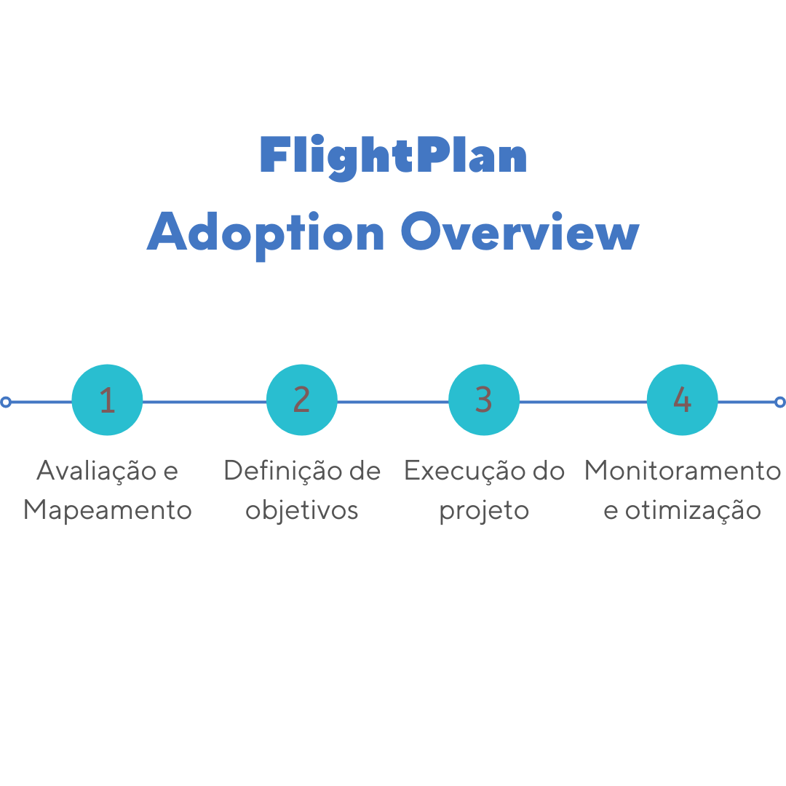
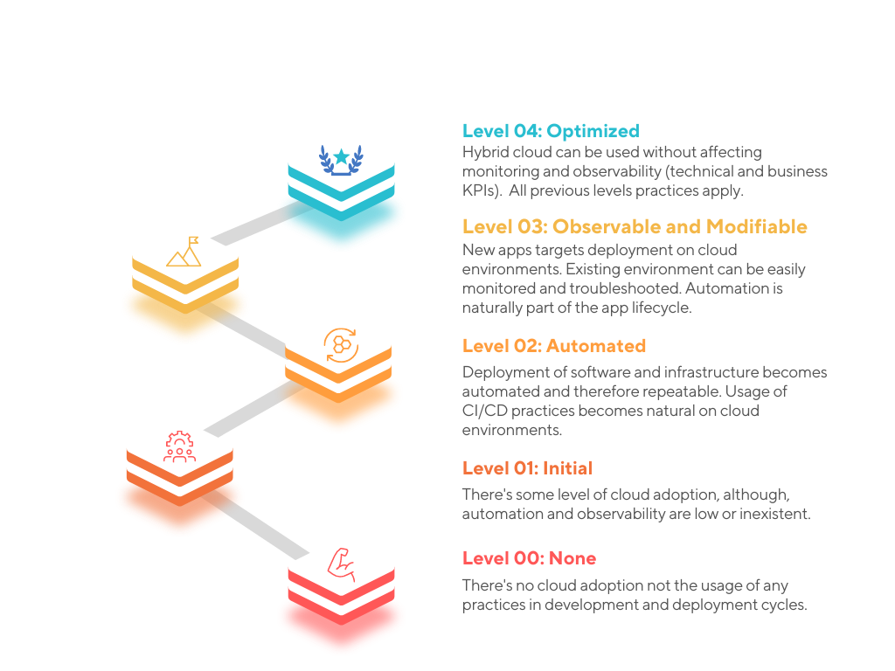

# WIP Plano de Vôo do Java: rumo à cloud  

Empresas que desejam iniciar ou evoluir sua adoção de ambientes de cloud passam por um processo de identificação do cenário atual e definição do cenário desejado. 

> *"Para aquele que não sabe onde quer ir, qualquer caminho serve."*
> Tradução livre inspirada em Lewis Carroll e sua obra "Alice no país das maravilhas".

Nesta jornada, podemos imaginar situações onde:
a) Deu-se um passo longo demais, além do que o time podia caminhar: falha;  
b) Deu-se um passo menor que conseguiria-se: sucesso, mas baixo do aproveitamento de potencial;
c) Deu-se um passo na distância correta: atingiu-se o objetivo.

Nesta transformação são necessárias modernização os mais diversos setores — organização de times, metódos de gerenciamento de projetos, cultura de deploy, design e arquitetura das aplicações, infraestrutura, segurança, dentre outros. Considerando tamanho impacto e esforço, é essencial não apenas definir **para onde ir**, mas entender **onde se está**, para só então descobrir **como chegar lá**. Em outras palavras:

> **Onde ir?**: objetivo da jornada, resulta em maturidade na adoção, expansão e práticas acerca de ambientes de cloud e suas aplicações;
> **Onde se está?**: Panorama organizacional de práticas e setores envolvidos com as aplicações que fazem parte do escopo da modernização;
> **Como chegar lá?**: Definição e execução de processos otimizados para cada setor levando em consideração a origem e destino.  

Então afinal de contas, como responder estas perguntas? 

Já que nosso plano é ir às nuvens, de forma análoga, podemos aplicar uma prática fundamental para um vôo seguro e fluxo aéreo controlado: o **plano de vôo**. 

Vejamos caracterísicas de um plano de vôo no mundo da aviação:
- É um dos processos mais importantes de um vôo comercial;
- Sem ele é impossível a existência do controle de tráfego aéreo;
- Mesmo seus pequenos ajustes de otimização geram economia significativa para frota e positivo impacto ambiental (redução de emissão de dióxido de carbono (CO2));
- Aumenta as chances de que a aeronave cumpra com todos os regulamentos operacionais necessários para aquele vôo.
- Contém informações essenciais para que a tripulação do vôo possa conduzir de maneira segura;
- Geralmente é automatizado, monitorado e otimizado por sistemas que calculam e geram planos de vôo automaticamente.

I> **Você sabia?**
I>
I> A queima de ~3.8 litros de combustível (equivalente a um galão em medida norte americana, U.S. gallon) emite mais de 9kg (20 libras) de CO2 no meio ambiente.

Conectando estas idéias ao nosso contexto de aplicações Java e mundo da cloud, surgiu a estratégia: "Plano de Vôo do Java" (em inglês, "Java Flightplan"). De maneira geral:

{aside}
  C> ### O Plano de Vôo é
 
Um modelo de adoção de ambientes de cloud, uma definição estratégica otimizada de processos acerca do vôo (transformação digital) para a cloud. Define uma rota com origem, destino, e informações que permitem que a tripulação (equipes envolvidas) execute de segura e eficiente.
{/aside}

Este modelo de adoção da cloud é como um guia. Nele o leitor pode aprender:
* Como mapear o cenário técnico e os processos organizacionais atuais;
* Pontos de atenção durante o mapeamento;
* O que e quais são serviços de cloud; 
* Sobre as novidades do ecossistema Java que possibilitam criação de apps Java verdadeiramente cloud-native;
* A respeito dos níveis de adoção, desde o zero até o estado da arte;
* A monitorar e mensurar custos e pontos de melhoria;  

## Como funciona o Plano de Vôo

O modelo Plano de Vôo para a cloud é composta por [três abordagens](#chap03-figure02): 
- Definição de estratégia (Origem/Destino)
- Detalhamento do plano (Como chegar lá)
  : {#chap03-figure02}
  : 

### A estratégia

A adoção da cloud é composta por uma ou mais iterações, onde iteração passa por três fases:

Avaliação e Mapeamento 

 : Busca descrever o cenário técnico atual em que se encontra o ambiente e a organização, incluindo detalhes não apenas sobre as tecnologias utilizadas mas também aponta cultura, métodologias de gerenciamento de projetos e seu ciclo de vida. 
 
Definição de objetivos

 : Definem-se os objetivos da iteração. Nesta fase, utilizam-se os níveis de maturidade representados na [figura 01](#chap03-figure01)

 : {#chap03-figure01}
 : 

 ,#TODO [add informacao sobre os niveis]

I> O Plano de Vôo *não* é uma definição de modelo de maturidade de adoção de ambientes de cloud. Entenda o motivo desta afirmação e aprenda mais sobre modelos de maturidade no [Apêndice A - Modelos de Maturidade](#apendice-a).

Execução do projeto

 : .#TODO

Monitoramento e otimização
 
 : .#TODO

Antes de passarmos para o próximo capítulo, que tal fazer uma rápida prática?

## Abra suas asas, mas tenha seu plano de vôo

Nesta prática considere que somos consultores e fomos convidados pelo cinema Acme Studios a auxiliar na definição da estratégia a ser seguida — o **Plano de Vôo**. Neste primeiro momento, devemos prover uma análise inicial de como seria o projeto de modernização da Acme Studios.

1. Nosso primeiro passo é identificar **onde estamos**. Em uma conversa, o cliente nos reporta:

    > *"Estamos no mercado a vinte anos. Novos serviços estão por vir, mas precisamos manter também aplicações já em produção, como por exemplo a nossa boa e velha aplicação de venda de ingressos. Tudo isso roda em máquinas virtuais em nosso próprio datacenter. 
   > A maioria de nossas aplicações são Java e os deploys são manuais — requerem agendamento prévio, coordenação e presença dos times que acompanharão a execução. Formamos times grandes e separados com base em função, por exemplo, equipes de desenvolvimento, arquitetura, infraestrutura, etc. 
   > Considerando essas informações, como usar serviços de cloud a nosso favor?"*

   Identificamos aqui o mais básico cenário - nenhuma adoção de soluções de cloud. O ecossistema, baseado em Java, é constituído de aplicações novas e legadas. O ciclo de vida da aplicação é longo e a manutenção é custosa. A estrutura organizacional não permite efetivas práticas ágeis.   

2. Descobrimos onde estamos, agora precisamos definir para **onde vamos**. 

    Q> Mas espere um pouco. Este cliente é ambicioso, talvez ele tenha expectativas acima do que pode realizar. Se este for o caso, como deveríamos definir para onde vamos?
    Q> a) O vôo deve ter como objetivo final atender aquilo que cliente almeja.
    Q> b) O destino deve ser rumo ao próximo passo mais eficiente a partir desta origem, que pode diferir das expectativas do cliente;

    Se você escolheu a segunda opção b, acertou! É esperado que corporações tenham uma diretiva ambiciosa de modernização. Nestes casos, lembre-se que vôos podem ser diretos ou com conexões: um vôo pode levar diretamente ao destino, ou pode precisar de algumas pernas de vôo antes de chegar lá. Em outras palavras, projetos complexos requerem múltiplas repetições do processo de modernização.  

3. Por fim vamos definir, de forma geral, **como chegaremos lá**:

 . #TODO
